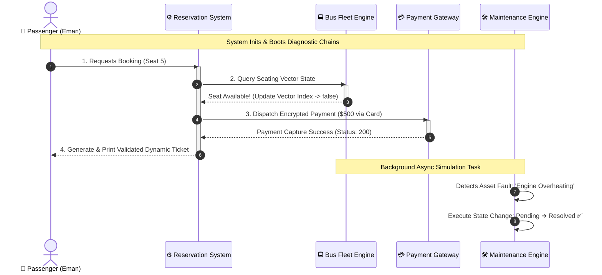

# 🚍 Live Bus Reservation & Management System


A highly responsive, console-based **Transit Operations Engine** written in C++. This project framework leverages advanced **Object-Oriented Programming (OOP)** patterns to simulate a live transit authority network—featuring continuous transaction processing, real-time state tracking, and reactive diagnostic mechanics.

---

## 🎭 System Operations Workflow (Live View)

Below is the live operational workflow of the orchestration engine. 



---

## ⚡ Core Animated System Modules

<details open>
<summary><b>🟢 Click to Expand: Dynamic Class Matrix</b></summary>

### 👥 Polymorphic Identity Matrix
*   **Unified Base Identity:** Derives operational profiles (`Passenger`, `Driver`, `Staff`) dynamically from a shared `Person` runtime schema.
*   **Dynamic Overrides:** Utilizes virtual tables (`vtable`) to safely resolve user characteristics without performance overhead.

### 🎫 State-Safe Booking Engine
*   **Vector State Map:** Uses strict tracking matrices (`std::vector<bool>`) to allocate, lock, and free seating allocations interactively.
*   **Boundary Control:** Actively drops bad out-of-bound requests before data streams execute.

### 💳 Abstracted Financial Gateway
*   **Polymorphic Pipelines:** Dynamically morphs operational paths between card-encrypted transactions and localized physical cash ledgers on the fly.
</details>

---

## 🏗️ Technical Architecture Breakdown

| OOP Principle | Design Pattern Implementation | Visual System Impact |
| :--- | :--- | :--- |
| **Inheritance** | Structural extension of target schemas (`Person`, `Payment`). | Core reuse; reduces memory allocation sprawl. |
| **Polymorphism** | Runtime lookups via `virtual void displayInfo() const override`. | Allows disparate human entity classes to self-report safely. |
| **Composition** | `BusRoute` embedded as an initialization asset inside `Bus`. | High lifecycle coupling; paths drop out if the asset drops out. |
| **Encapsulation**| Isolation of sensitive vector buffers using `protected:` access bounds. | Halts unsafe out-of-scope system modifications dead. |

---

## 🚀 Terminal Deployment Pipeline

### Prerequisites
Ensure your native machine terminal environment includes an active **ISO C++11 compliant compiler engine** (e.g., GCC/G++ `>= 4.8.1` or modern Clang).

### Compilation Pipeline
Open your development directory terminal and run the compilation layer:
```bash
g++ -std=c++11 main.cpp -o TransitOperationsEngine
```

### Execution Launch
Launch the system engine instance:
```bash
./TransitOperationsEngine
```

---

## 📊 Standard Runtime Verification Log

When booted, the system runs an automated suite test, generates validation structures, asserts payment processing success states, and sweeps fleet asset logs:

```text
Bus Number: B001
Route: Islamabad -> Lahore (Distance: 300 km)
Total Seats: 20
Seat 5 booked successfully!

--- Ticket Details ---
Passenger - Name: Eman, Age: 22
Seat Number: 5, Fare: \$500
Processing card payment of \$500 using card: 1234-5678-9012-3456
Ticket validated successfully!
Query resolved: Duplicate ticket issued.
Issue 'Engine overheating' for Bus B001 has been resolved.
Maintenance Status for Bus B001: Engine overheating - Resolved
```
