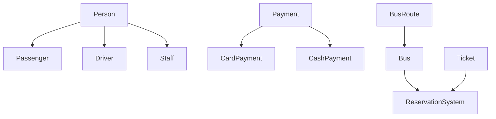

# Bus Reservation & Management System

Yeh ek console-based **Bus Reservation aur Operations Management System** hai jise **C++** mein implement kiya gaya hai. Is project mein Object-Oriented Programming (OOP) ke core concepts (Inheritance, Polymorphism, Encapsulation aur Composition) ka use karke real-world bus transit system ko simulate kiya gaya hai.

---

## ✨ Features (Khususiyaat)

*   **Seat Booking Engine:** Real-time seat allocation jo seat availability aur valid numbers ko check karta hai.
*   **Polymorphic Payments:** Card aur Cash dono tarah ki payments ko abstract gateway interface ke zariye process karta hai.
*   **Role Hierarchy:** Ek single identity foundation (`Person` class) se `Passenger`, `Driver`, aur `Staff` ke roles ko manage karta hai.
*   **Operational Modules:** Isme Ticket Validation, Customer Support queries resolver, aur Bus Maintenance tracker shamil hain.

---

## 🏗️ Architecture & OOP Concepts

Is project ko modular aur readable banane ke liye OOP ke pillars ka istamal kiya gaya hai:

*   **Inheritance & Polymorphism:** 
    *   `Person` ek base class hai jise `Passenger`, `Driver`, aur `Staff` inherit karte hain aur runtime polymorphism ke liye `displayInfo()` method ko override karte hain.
    *   `Payment` ek base class hai jise `CardPayment` aur `CashPayment` override karke apni specific implementation chalate hain.
*   **Composition:** `Bus` class ke andar `BusRoute` ka object use kiya gaya hai taake har bus ke paas apna specific route map majood ho.
*   **Encapsulation:** Data elements (jaise seats vector, card numbers, age) ko `protected` ya `private` access modifiers ke andar safe rakha gaya hai aur unhe public functions ke zariye access kiya jata hai.

### System Class Structure



---

## 🚀 How to Run (Chalanay ka Tariqa)

### Prerequisites
Aapke system par koi bhi modern C++ compiler (jaise GCC/G++ ya Clang) installed hona chahiye jo **C++11** ya usse higher version support kare.

### Compilation
Apne code ko `main.cpp` file ke naam se save karein aur terminal par yeh command chalayein:

```bash
g++ -std=c++11 main.cpp -o BusReservationSystem
```

### Execution
Program ko run karne ke liye yeh command likhein:

```bash
./BusReservationSystem
```

---

## 📊 Sample Output (Umeed-shuda Output)

Jab aap is program ko run karenge, to console par kuch aisa flow dikhega:

```text
Bus Number: B001
Route: Islamabad -> Lahore (Distance: 300 km)
Total Seats: 20
Seat 5 booked successfully!

--- Ticket Details ---
Passenger - Name: Eman, Age: 22
Seat Number: 5, Fare: \$500
Processing card payment of \$500 using card: 1234-5678-9012-3456
Ticket validated successfully!
Query resolved: Duplicate ticket issued.
Issue 'Engine overheating' for Bus B001 has been resolved.
Maintenance Status for Bus B001: Engine overheating - Resolved
```
