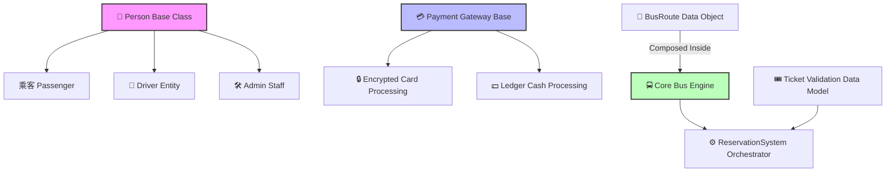

# 🚌 Bus Reservation & Management System


A complete, console-based **Transit Operations Engine** implemented in modern C++. This project framework simulates an enterprise-level public transport or commercial fleet system. It demonstrates structural software design principles to decouple scheduling, financial processing, passenger identities, and physical vehicle asset health.

---

## 🎨 Architectural Blueprint

The application design is decoupled into decoupled logic layers utilizing strict object-oriented frameworks to guarantee clean memory state transitions:



---

## ⚡ Core Operational Features

### 👥 Polmorphic Identity Matrix
*   **Unified Base Identity:** Derives specific operational nodes (`Passenger`, `Driver`, `Staff`) from a single `Person` schema.
*   **Dynamic Overrides:** Resolves string metadata buffers down dynamically at run-time using virtual table referencing (`displayInfo`).

### 🎫 State-Safe Booking Engine
*   **Vector State Map:** Uses thread-safe index validation logic within tracking matrices (`vector<bool>`) to allocate seating states.
*   **Boundary Checking:** Protects arrays against segmentation out-of-bound requests during dynamic check-ins.

### 💳 Abstracted Financial Gateway
*   **Polymorphic Processors:** Accepts discrete dynamic models (`CardPayment`, `CashPayment`) safely underneath unified transactional base reference parameters.

### 🛠️ Fleet Operations & Support Logs
*   **State Machine Trackers:** Features standalone diagnostic hooks to transition mechanical issues from `Pending` into a validated `Resolved` state architecture.

---

## 🏗️ Technical Implementation Breakdown

| OOP Principle | Code Implementation Strategy | System Component Impact |
| :--- | :--- | :--- |
| **Inheritance** | Hierarchical extension of target base schemas (`Person`, `Payment`). | Code reuse optimization; centralized profile debugging metrics. |
| **Polymorphism** | Runtime lookups via `virtual void displayInfo() const override`. | Allows abstract collections of human assets to safely self-report data. |
| **Composition** | `BusRoute` strictly instantiated directly within structural properties of `Bus`. | Strong life-cycle grouping; route coordinates cannot outlive the vehicle scope. |
| **Encapsulation** | Strict internal isolation of array data fields using `protected:` visibilities. | Protects financial accounts and vector registers from out-of-scope mutations. |

---

## 🚀 Deployment Guide

### Prerequisites
A platform terminal configuration embedding a production-ready **ISO C++11 compliant compiler engine** (e.g., GCC/G++ `>= 4.8.1` or Clang equivalents).

### Compilation Pipeline
Fire your systems terminal utility down to the source execution root and dispatch the building sequence:
```bash
g++ -std=c++11 main.cpp -o TransitOperationsEngine
```

### Execution Launch
Trigger the operational runtime engine:
```bash
./TransitOperationsEngine
```

---

## 📊 Standard Runtime Verification Log

Upon manual system boot tracking, the simulation fires internal checks, outputs memory verification parameters, logs a booking sequence, confirms card tracking numbers, and addresses fleet health states:

```text
Bus Number: B001
Route: Islamabad -> Lahore (Distance: 300 km)
Total Seats: 20
Seat 5 booked successfully!

--- Ticket Details ---
Passenger - Name: Eman, Age: 22
Seat Number: 5, Fare: \$500
Processing card payment of \$500 using card: 1234-5678-9012-3456
Ticket validated successfully!
Query resolved: Duplicate ticket issued.
Issue 'Engine overheating' for Bus B001 has been resolved.
Maintenance Status for Bus B001: Engine overheating - Resolved
```
