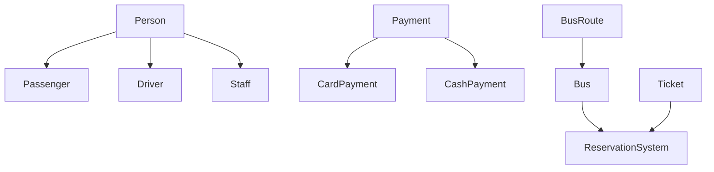

# Bus Reservation & Management System

A complete, console-based **Bus Reservation and Operations Management System** implemented in **C++**. This project demonstrates core **Object-Oriented Programming (OOP)** pillars to simulate a real-world transit workflow, including dynamic seat booking, polymorphic payment gateways, passenger/staff identification, ticket validation, and fleet maintenance tracking.

---

## ✨ Features

*   **Seat Booking Engine:** Real-time seat allocation tracking with boundary validation and availability checks.
*   **Polymorphic Payments:** Flexible payment infrastructure processing both Card and Cash transactions via an overridden gateway method.
*   **Role Hierarchy:** Structured management of `Passenger`, `Driver`, and `Staff` profiles derived from a unified identity foundation (`Person` class).
*   **Operational Modules:** Built-in modules for real-time ticket validation, customer support query resolution, and mechanical maintenance updates.

---

## 🏗️ Architecture & OOP Concepts

The application architecture utilizes clean OOP guidelines to keep the codebase modular, readable, and highly scalable:

*   **Inheritance & Polymorphism:** 
    *   `Person` acts as the central base class. `Passenger`, `Driver`, and `Staff` extend it and override the `displayInfo()` method for runtime polymorphic execution.
    *   `Payment` serves as a parent model overridden by `CardPayment` and `CashPayment` to run specific transactional logic.
*   **Composition:** The `Bus` class encapsulates a distinct `BusRoute` object instance to tightly couple each fleet vehicle to its dedicated pathway coordinates and distances.
*   **Encapsulation:** Critical attributes (such as seating vectors, credit card numbers, and active system statuses) are hidden using `protected` or `private` scopes and altered only through secure public member methods.

### System Class Structure



---

## 🚀 How to Run

### Prerequisites
To compile and run this program, you will need a compiler that supports **C++11** or a newer release (such as GCC/G++ or Clang).

### Compilation
Save your source code into a file named `main.cpp` and compile using your command line terminal:

```bash
g++ -std=c++11 main.cpp -o BusReservationSystem
```

### Execution
Execute the compiled binary executable using the following command:

```bash
./BusReservationSystem
```

---

## 📊 Sample Output

Upon execution, the project runs through a programmatic simulation test loop producing the following console log:

```text
Bus Number: B001
Route: Islamabad -> Lahore (Distance: 300 km)
Total Seats: 20
Seat 5 booked successfully!

--- Ticket Details ---
Passenger - Name: Eman, Age: 22
Seat Number: 5, Fare: \$500
Processing card payment of \$500 using card: 1234-5678-9012-3456
Ticket validated successfully!
Query resolved: Duplicate ticket issued.
Issue 'Engine overheating' for Bus B001 has been resolved.
Maintenance Status for Bus B001: Engine overheating - Resolved
```
